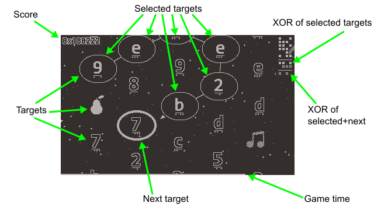
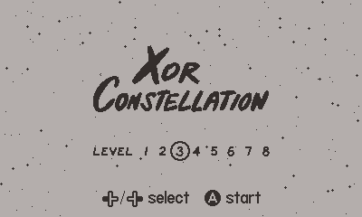

# Xor Constellation

Make constellations by connecting values that XOR to all zeroes or all ones.

https://uguu-org.itch.io/xor-constellation

## Controls

The goal of the game is to connect targets into constellations such that the [bitwise XOR](https://en.wikipedia.org/wiki/Bitwise_operation#XOR) of selected values contains all zero bits or all one bits, using these controls:

+ (undocked) **Crank**: select next target.
+ (docked) **Left** / **Right**: select next target.
+ **Up** / **A**: add next target to selected set.
+ **Down** / **B**: undo.

The list of dots in the upper right corner of the screen shows the current status: solid dots indicate the currently selected targets and the XOR result, while hollow dots show a preview of the XOR result when next target is added to current constellation.  Thus the goal is to get the bottom row to show no dots (`0` or `00`) or all dots (`F` or `FF`).

Each target contains one or two hexadecimal digits depending on game level.  For variety, targets that would have been `0` or `00` are drawn with a random image instead of hexadecimal digits.

A white bar at the bottom of the screen shows how much thinking time has been used.  This bar grows slowly if player acts quickly, and more rapidly if player sits idle.  The screen will start to fade to white once 80% of the allotted time has been used, and game ends when screen turns completely white.

## Level select

Press **Left** / **Right** on title screen to select a difficulty level.

If you have recorded any high score for a particular level, pressing **Up** followed by **A** will allow the high score to be reset.

## Menu options

+ **Reset**: Go back to title screen.

+ **Hint**: Control hint display: delayed (default) = show hint lines after a few seconds of idleness, visible = always show hint lines, hidden = hide hint lines.

Hint lines show the path to building two constellations, one with XOR value of all zeroes, and the other with XOR value of all ones.  These are not necessarily the highest or lowest scoring constellations, they are there just to show that both options exist.  Hint lines are hidden if current partial constellation no longer follows the hint lines.

## FAQ

Q: I don't see any hints despite setting the option to "visible"?
A: Keep pressing **B** to undo adding targets and eventually the lines will show up.

Q: I can't seem to score any points at all!\
A: In levels 1-4, you should be able to score just by keep going straight, or by playing randomly.  This is because you have a 1 in 8 chance of hitting a target with the right bit value.  This probability drops to 1 in 128 in levels 5-8, so a more deliberate strategy is needed.  In general, you want to recognize numbers that are bit complements of each other, and use those to reach the targets that would complete your constellation.

Q: Do the images mean anything?\
A: They are mostly just for variety, although two of them have extra bonus multipliers associated with them.

Q: I am playing this in the simulator and the game becomes laggy after a while.
A: Try playing with Malloc Pool disabled, or manually clear malloc history periodically.
